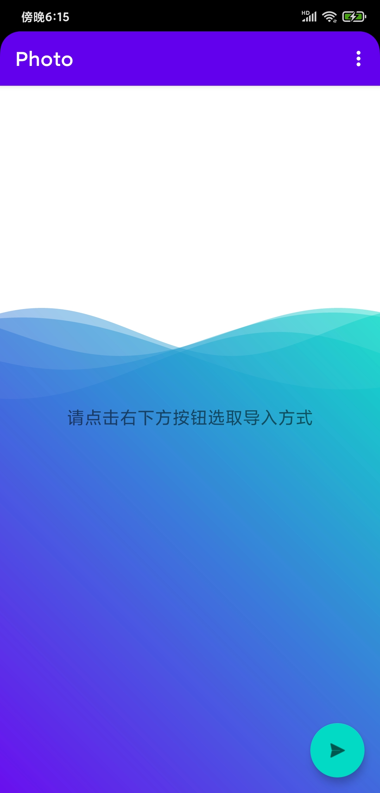
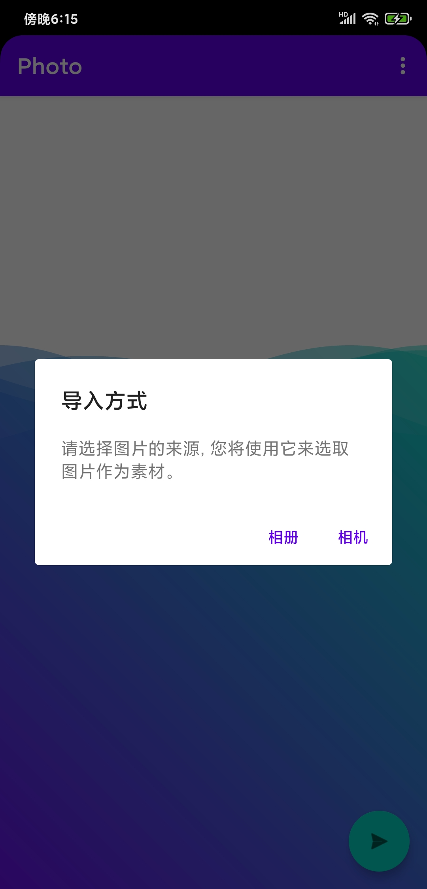
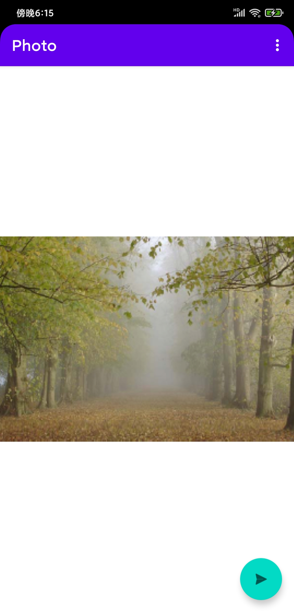
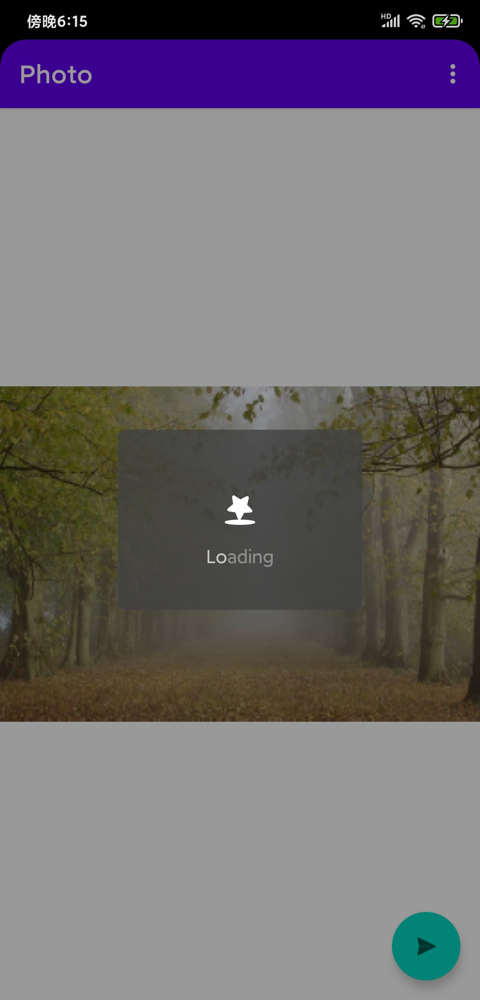
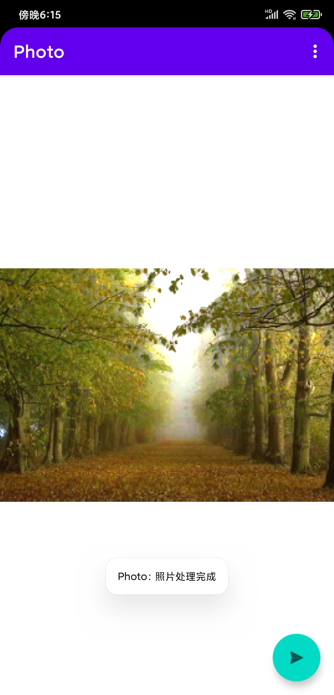

# NWU_photo

基于 CS 架构的图片去雾处理 APP,支持从相册与相机两种选取方式

## 技术栈

- 客户端
  - Android：使用 Kotlin 开发，Android9、10、11（最新版）已通过相关测试。
- 服务端
  - Docker：用于环境搭建
  - Python-OpenCv：去雾算法基于 OpenCv，核心算法来源[在这里](https://github.com/anhenghuang/dehaze)，再次感谢开源精神。当然使用机器学习可以更好的实现去雾效果，但机器学习的环境难以搭建并且占用资源过多，故不采用

## 项目结构

- Photo
  存放的是客户端源代码，其中`app/release`目录下存放有各个版本的 apk 安装包，可用于自行安装。但个人推荐自行重新修改编译并发布，因为 app 中请求的服务端 URL 链接已经写死，当你看到该项目时相应的服务端服务大概率已经被停掉了，具体修改操作见下文。
- PhotoServe
  存放的是服务端代码，图片去雾在此处处理。后端使用 docker 进行环境部署，你可以很轻松的将其部署到你的服务器上。同时该项目使用 HTTP 进行前后端通信，后端使用的是 python-flask 库开发出来的 API 接口，监听的是本地 7999 端口，你可以自行改动 docker 配置文件满足自己的需求。

## 效果截图

## 使用方法

我仍然推荐你将全部代码下载至本地，进行修改之后查看效果，因为你看到该项目时相应的服务端已经被停掉了(再次重复)。

具体操作如下：

1. 将 PhotoServe 部分放入服务器，进入其根目录使用 docker 部署它，此时你的 7999 端口已经被监听(若你没有修改过 docker 配置文件)并提供了相应服务，可通过 postMan 等工具来测试它。但是还没完，因为 Android 需要使用 HTTPS 进行通信，否则请求不能发送
2. 使用 nginx 等对本地 7999 进行代理转发，并对外提供 SSL 层，使其支持 HTTPS。此时你应该有了一个对外提供服务的支持 HTTPS 的 URL，在此将其记作 u1，服务端搭建完成
3. 将 Photo 部分通过 Android Studio 打开，并将`src\main\java\top\sanqii\photo\FirstFragment.kt`文件下第 41 行`requestsUrl`属性改为你在第二步中得到的 u1
4. 使用 Android Studio 对项目进行构建，得到 apk 文件，这时可将其作为成品使用了，整个部署流程到此结束

## 一点说明

项目整体结构并不复杂，因为它设计出来仅仅用于一个活动的效果展示，我将该项目上传是觉得它整体仍有可复用的余地，你应该知道，从头开发设计一个 Android 客户端并不轻松

## 作者

西北大学蒟蒻本科生 (很快就不是了，时间真快啊，已经大三了)

## 授权

无偿开源, 请遵循[GNU GPLv3](https://www.gnu.org/licenses/gpl-3.0.html)开源许可
